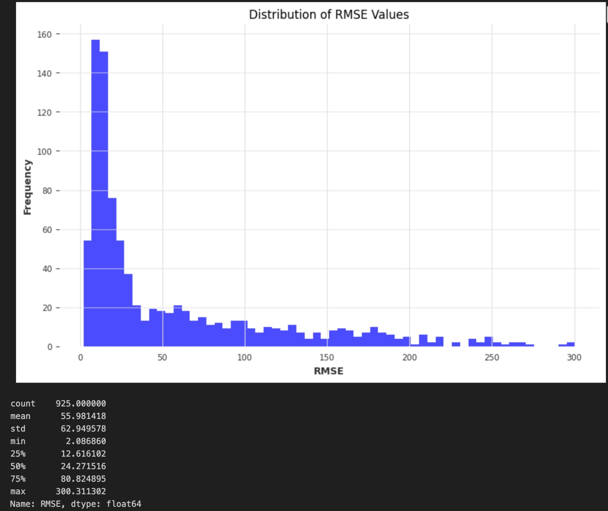

# Data Crunch - CSE, UoM

# [Legacy of the Market King: The Freezer Gambit]() 🌾🌦️

# AgroChill Time Series Forecasting System

This project aims to develop a time series forecasting system for predicting weekly fresh prices of vegetables and fruits in the Agrovia kingdom. The system uses historical weather and price data to forecast future prices, enabling the effective implementation of the **Freezer Gambit**, which allows Magnus Greenvale to preserve produce for better market prices.

## Project Overview

The solution provides an API for forecasting future prices of agricultural commodities in various regions of Agrovia. The forecasts are based on a dataset that includes weather data (temperature, rainfall, humidity) and price data for commodities (fruits and vegetables). The system is designed to predict prices up to 4 weeks ahead and continuously adapt with new incoming data via streaming or API calls.

### Key Features:
- **Time Series Forecasting:** Predicts weekly prices of commodities one month ahead.
- **Data Pipeline:** Incorporates new data dynamically through APIs or streaming sources.
- **Dockerized:** The entire solution is packaged within a Docker container for easy deployment.
- **Business Insights:** Provides actionable recommendations for AgroChill's cold storage strategy.

### Instructions
docker pull lasitharandula/agrochill:latest
docker run -p 8000:8000 lasitharandula/agrochill:latest
http://localhost:8000/docs

### Model Accuracy
